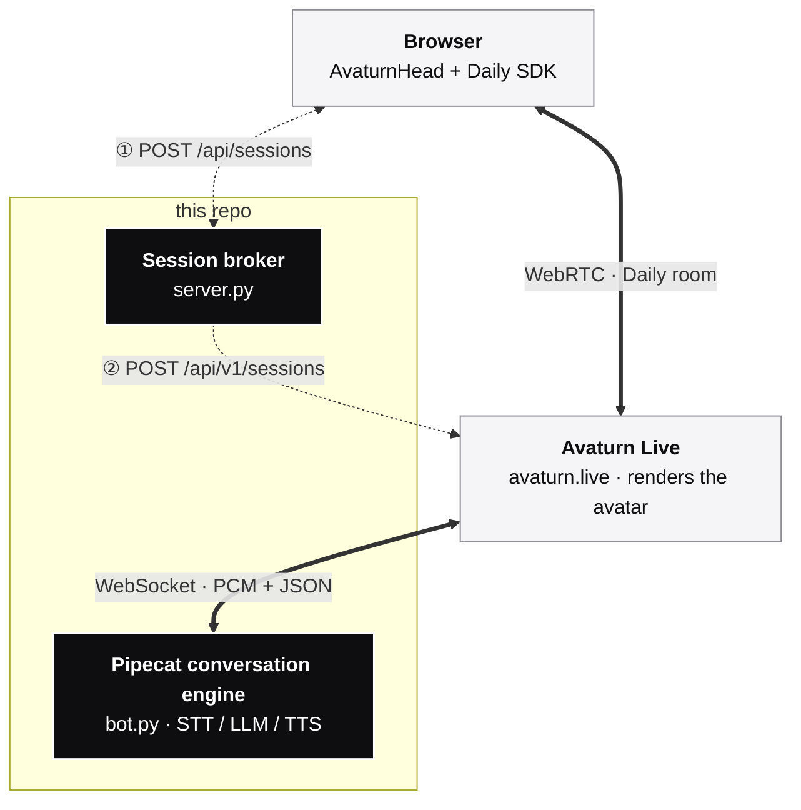

# Pipecat × Avaturn Live demo

Open-source reference for driving an **Avaturn Live** avatar with a
**Pipecat Cloud** agent. Fork it, point it at your API keys, and you
have a real-time AI talking head you can ship to users in an afternoon.

> "Avaturn Live" — the real-time AI avatar product at
> [avaturn.live](https://avaturn.live)



The default pipeline is **OpenAI Realtime** (speech-to-speech in one
service); see `pipecat_avaturn/agent.py` to swap in a cascaded
STT → LLM → TTS pipeline.

---

## How the integration works

Avaturn Live's session-create call takes a `conversation_engine` field
with `type: "external"`. Avaturn Live opens a WebSocket to the URL you
provide there and exchanges:

| Direction              | Payload                                         |
|------------------------|-------------------------------------------------|
| Avaturn Live → engine  | binary PCM16LE @ `user.sample_rate` (mic audio) |
| engine → Avaturn Live  | binary PCM16LE @ 24 kHz (avatar speech)         |
| engine → Avaturn Live  | JSON `avatar.speech.segment.create` / `close`   |
| engine → Avaturn Live  | JSON `avatar.speech.interrupt`                  |
| Avaturn Live → engine  | JSON `avatar.speech.segment.playback.*` events  |

Every burst of avatar audio must be wrapped in `segment.create` /
`segment.close`. This repo provides:

- `pipecat_avaturn.serializer.AvaturnLiveFrameSerializer` —
  bidirectional Pipecat ↔ Avaturn Live wire format.
- `pipecat_avaturn.segment_processor.BotSpeechSegmentProcessor` —
  watches `TTSStarted/Stopped` and emits the segment envelopes.
- `pipecat_avaturn.transport.AvaturnLiveFastAPIWebsocketTransport` —
  Pipecat's FastAPI WS transport with the real-time pacing sleep
  disabled (Avaturn Live has its own playback clock).
- `pipecat_avaturn.broker.AvaturnLiveClient` — server-side client for
  Avaturn Live's `POST /api/v1/sessions`.

---

## Quickstart (self-host)

```bash
git clone <this repo>
cd pipecat-avaturn-live-demo
cp .env.example .env
# fill in AVATURN_LIVE_API_KEY and OPENAI_API_KEY at minimum

uv sync
uv run uvicorn server:app --host 0.0.0.0 --port 8000
```

Open <http://localhost:8000> and click **Join**.

> Avaturn Live must be able to reach your conversation engine over the
> public internet. For local development run a tunnel and put the
> public URL in `CONVERSATION_ENGINE_PUBLIC_URL` (use `wss://`):
>
> ```bash
> cloudflared tunnel --url http://localhost:8000
> ```

## Quickstart (docker compose)

```bash
cp .env.example .env
docker compose up --build              # http://localhost:8000

# Optional: expose conversation engine via a Cloudflare quick tunnel.
# Copy the printed wss:// URL into CONVERSATION_ENGINE_PUBLIC_URL and
# restart `server`.
docker compose --profile tunnel up
```

## Deploying to Pipecat Cloud

PCC runs only the conversation engine. The session broker stays in your
own backend (or this repo's `server.py`) and holds `AVATURN_LIVE_API_KEY`.

**1. Deploy the agent.**

```bash
pcc auth login
pcc secrets set avaturn-live-demo OPENAI_API_KEY=sk-...
pcc deploy --yes
```

`pcc-deploy.toml` already sets `websocket_auth = "token"`, so PCC issues
a short-lived HMAC token per session and rejects unauthenticated WS
upgrades before they reach `bot()`.

The included [GitHub Action](.github/workflows/deploy.yml) wires this up
automatically — drop `PCC_API_KEY` into your repo secrets and every push
to `main` redeploys via cloud-build (no Docker registry needed).

**2. Point the broker at it.**

```bash
PIPECAT_CLOUD_PUBLIC_KEY=pk_...                  # PCC project public key
PIPECAT_CLOUD_AGENT_NAME=avaturn-live-demo
AVATURN_LIVE_API_KEY=...                         # Avaturn Live project key
```

When those two PCC vars are set, the broker:

1. calls `POST https://api.pipecat.daily.co/v1/public/avaturn-live-demo/start`
   with `{"transport": "websocket"}` → gets back `wsUrl`, `token`,
   `sessionId`.
2. creates an Avaturn Live session whose `conversation_engine.url` is
   `{wsUrl}/{token}` (URL-path token, per the
   [PCC auth guide](https://docs.pipecat.ai/pipecat-cloud/guides/websocket-authentication)).

Avaturn Live opens that URL, PCC validates the HMAC token, the
per-session pod spins up, and `bot()` runs the pipeline. No shared
secret needed in this mode — the token replaces it.

### Production checklist

The `pcc-deploy.toml` shipped here is tuned for dev. Before going live:

| Field                                | Why bump it                                          |
|--------------------------------------|------------------------------------------------------|
| `[scaling].min_agents = 1`           | PCC cold start is ~10 s; the first user otherwise stares at a "connecting…" spinner. Raise further if you expect bursty traffic (capacity formula in the [planning guide](https://docs.pipecat.ai/pipecat-cloud/guides/capacity-planning)). |
| `region = "us-east"`                 | Pin to the region closest to Avaturn Live's infra and your users — defaults to a generic region otherwise. Options: `us-west`, `us-east`, `eu-central`, `ap-south`. |
| `max_session_duration`               | Hard cap (seconds). Aligns with Avaturn Live's own `max_duration`; without it a wedged WS keeps a pod billable. |
| `FROM dailyco/pipecat-base:0.1.20`   | The Dockerfile pins a specific base tag; bump deliberately and re-test on each new release. |
| `agent_profile = "agent-1x"`         | Audio-only fits 1x; keep an eye on resource usage if you switch to a heavier pipeline. |

---

## Repository layout

```
pipecat-avaturn-live-demo/
├── bot.py                       # Pipecat Cloud entry — async def bot(args)
├── server.py                    # Standalone FastAPI: broker + /avaturn-live/ws + frontend
├── pipecat_avaturn/
│   ├── agent.py                 # Builds & runs the Pipecat pipeline
│   ├── broker.py                # AvaturnLiveClient (HTTP) — copy this alone if you
│   │                            # just need to call POST /api/v1/sessions
│   ├── frames.py                # Pipecat frames mirroring Avaturn Live lifecycle events
│   ├── segment_processor.py     # Wraps audio in segment.create/close envelopes
│   ├── serializer.py            # The wire-format boundary; protocol lives here
│   ├── settings.py              # Pydantic Settings (one source of truth)
│   └── transport.py             # FastAPI WS transport with pacing-sleep disabled
├── frontend/
│   └── index.html               # Minimal AvaturnHead consumer (esm.sh, no build)
├── tests/                       # Unit tests for the wire-format & segment FSM
├── Dockerfile                   # Pipecat Cloud image (FROM dailyco/pipecat-base)
├── Dockerfile.server            # Self-host image (uvicorn server:app)
├── compose.yml                  # docker compose (+ cloudflared tunnel profile)
├── pcc-deploy.toml              # Pipecat Cloud deploy manifest
├── pyproject.toml               # Deps + tooling (ruff, basedpyright, pytest)
└── uv.lock
```

The integration logic sits entirely in `pipecat_avaturn/`. The rest is
glue (the FastAPI server, the demo frontend, the Dockerfiles).

---

## Configuration reference

All settings are read from environment variables (or `.env`).

| Variable                              | Purpose                                            |
|---------------------------------------|----------------------------------------------------|
| `AVATURN_LIVE_API_KEY`                | Avaturn Live project API key (broker only)         |
| `AVATURN_LIVE_API_URL`                | Avaturn Live REST base, defaults to `https://api.avaturn.live` |
| `AVATURN_LIVE_DEFAULT_AVATAR_ID`      | Avatar id when the request doesn't specify one     |
| `CONVERSATION_ENGINE_PUBLIC_URL`      | Origin Avaturn Live opens the WebSocket against    |
| `CONVERSATION_ENGINE_WS_PATH`         | WS path on that origin, defaults to `/avaturn-live/ws` |
| `CONVERSATION_ENGINE_SHARED_SECRET`   | Bearer token Avaturn Live must send. Required when the engine is internet-facing — without it, anyone who finds the WS URL can attach. |
| `PIPECAT_CLOUD_PUBLIC_KEY`            | PCC project public key (only in PCC mode)          |
| `PIPECAT_CLOUD_AGENT_NAME`            | Deployed PCC agent name (only in PCC mode)         |
| `OPENAI_API_KEY`                      | OpenAI Realtime API key (agent only)               |
| `OPENAI_REALTIME_MODEL`               | Realtime model, e.g. `gpt-realtime-1.5`            |
| `OPENAI_REALTIME_VOICE`               | Realtime voice (`alloy`, `echo`, …)                |
| `SYSTEM_PROMPT`                       | System prompt the LLM is bootstrapped with         |
| `USER_AUDIO_SAMPLE_RATE`              | Mic audio rate (16000 or 24000)                    |

---

## License

MIT — do whatever you want with it. PRs welcome.
